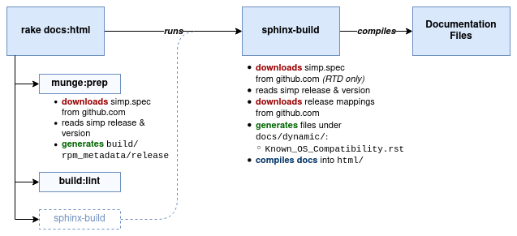

[](http://www.apache.org/licenses/LICENSE-2.0.html)
[](https://travis-ci.com/simp/simp-doc)

#### Table of Contents

<!-- vim-markdown-toc GFM -->

* [Description](#description)
* [Setup](#setup)
  * [Setup requirements](#setup-requirements)
  * [Beginning with simp-doc](#beginning-with-simp-doc)
* [Usage](#usage)
  * [Building the docs](#building-the-docs)
  * [Packaging the `simp-doc` RPM](#packaging-the-simp-doc-rpm)
    * [Special considerations on EL6](#special-considerations-on-el6)
* [Reference](#reference)
  * [Build process](#build-process)
  * [Environment variables](#environment-variables)
    * [`SIMP_CORE_PATH`](#simp_core_path)
    * [`SIMP_BRANCH`](#simp_branch)
  * [Managing Sphinx prerequisites with `pip`](#managing-sphinx-prerequisites-with-pip)

<!-- vim-markdown-toc -->

## Description

This project contains documentation source for [SIMP][simp], a
compliance-management framework built on Puppet.

* The project source is primarily [reStructuredText][rest], compiled with
  [Sphinx][sphinx].
* The compiled version of this documentation is available online at
  http://simp.readthedocs.io/.
* If you find any issues, please submit them to our bug tracker at
  https://simp-project.atlassian.net/.

## Setup

### Setup requirements

* Python 3 & `pip` (for building the docs)
* Ruby 2.4+ & `bundler` (for rake tasks)

You may need some additional OS packages for building PDFs with sphinx

### Beginning with simp-doc

Install python dependencies:

```sh
virtualenv venv
source venv/bin/activate

pip install --upgrade pip setuptools
pip install -r requirements.txt
```

Install ruby dependencies:

```sh
bundle
```

## Usage

Common build tasks are automated with [rake][rake] (installed by bundler).

* To list all available build tasks, run: `rake -T`.
* To read documentation on a task, run: `rake -D <task name>`.

### Building the docs

Building the docs as an HTML site (generates directory structure under `html/`)

```bash
bundle exec rake docs:html
```

After building the HTML docs, you can run a local HTTP server to view them locally:

```bash
# run a local web server to view HTML docs on http://localhost:5000
rake docs:server[5000]
```


Build HTML docs, specifying a local [simp-core][simp-core] repository (this
will avoid downloading `simp.spec` from GitHub):

```sh
SIMP_CORE_PATH=/path/to/simp-core rake docs:html
```

Build HTML docs for a specific SIMP version, as specified by a tag/branch:

```sh
SIMP_BRANCH='6.4.0-0' rake docs:html
```


### Packaging the `simp-doc` RPM

#### Special considerations on EL6

If you want to build the RPM on EL6 systems, you will need to ensure that the
SCL and python versions are appropriately available using the following
repositories and check the RPM spec file for the relevant required packages.

```python
[centos-sclo-sclo]
name=CentOS-6 - SCLo sclo
baseurl=http://mirror.centos.org/centos/6/sclo/$basearch/sclo/
gpgcheck=1
enabled=1
gpgkey=file:///etc/pki/rpm-gpg/RPM-GPG-KEY-CentOS-SIG-SCLo

[centos-sclo-rh]
name=CentOS-6 - SCLo rh
baseurl=http://mirror.centos.org/centos/6/sclo/$basearch/rh/
gpgcheck=1
enabled=1
gpgkey=file:///etc/pki/rpm-gpg/RPM-GPG-KEY-CentOS-SIG-SCLo

[extras]
name=CentOS-$releasever - Extras
baseurl=http://mirror.centos.org/centos/$releasever/extras/$basearch/
gpgcheck=1
gpgkey=file:///etc/pki/rpm-gpg/RPM-GPG-KEY-CentOS-6
```


## Reference

### Build process



### Environment variables

#### `SIMP_CORE_PATH`

Path to a local [simp-core][simp-core] git repository.  Can be used to test new
revisions of the simp-core `Changelog.rst`.  This defaults to `../..`
under the assumption that this repository has been checked out as part of
the `simp-core` SIMP ISO build.

```bash
SIMP_CORE_PATH=$PWD/../simp-core rake docs:html
```

#### `SIMP_BRANCH`

Sets the tag/branch to use when automatically downloading `simp.spec` from the
[simp-core][simp-core] GitHub repository. The downloaded `simp.spec` file will
be read to determine the SIMP release and version variables used  while
building the docs.  If unset, the branch will default to `master`.

`SIMP_BRANCH=6.4.0-0 rake docs:html`

CAUTION:  `SIMP_BRANCH` is used **only** to determine the URL to download from
GitHub. It does **not** _directly_ set the SIMP release and version used
when building the documentation.


### Managing Sphinx prerequisites with `pip`

If you are using PyPi to manage python packages, you may need to run something
like the following:

```bash
# simp install
sudo pip install -q -r requirements.txt

# upgrading (needed in some cases when rst2pdf prereqs get stuck)
sudo pip install --upgrade --force-reinstall  -r requirements.txt -v
```

The prerequisites for **rst2pdf** may require extra OS packages:

```bash
# fedora 24
sudo dnf install -y libjpeg-devel zlib-devel python-devel

# centos 7
sudo yum install -y libjpeg-devel zlib-devel python-devel

# Debian 8.5 (containers)
sudo apt-get install -y python-dev zlib1g-dev libjpeg-dev

```

[simp]: https://simp-project.com
[simp-core]: https://github.com/simp/simp-core
[rest]: https://docutils.sourceforge.io/rst.html
[sphinx]: https://www.sphinx-doc.org/
[rake]: https://github.com/ruby/rake
