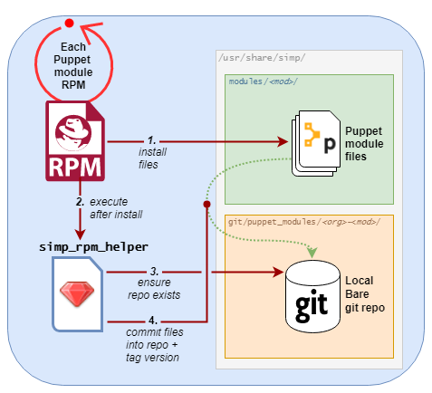

.. _changelog-6.4.0:

SIMP Community Edition (CE) 6.4.0-0
===================================

.. raw:: pdf

   PageBreak

.. contents::
  :depth: 2

.. raw:: pdf

   PageBreak

This release is known to work with:

  * CentOS 6.10 x86_64
  * CentOS 7.0 1810 x86_64
  * OEL 6.10 x86_64
  * OEL 7.6 x86_64
  * RHEL 6.10 x86_64
  * RHEL 7.6 x86_64

.. WARNING::

   Local modules installed in the modules directory
   can get deleted during upgrade.  Make sure you read the
   upgrade instructions carefully.

Breaking Changes
----------------

* Puppet 4 is no longer supported.

Significant Updates
-------------------

The most significant change with SIMP 6.4.0 is a redesign of the packaging of
SIMP RPMs, in order to support management of one or more :term:`Puppet
environments`.

The change allows SIMP users to easily use :term:`r10K` or :term:`Code Manager`
to maintain these environments, even when their systems are on isolated
networks.

Multiple environments are key to implementing standard :term:`DevOps` work
flows such as DTAP (Development > Testing > Acceptance > Production).

At the root of this change are the following major features:

* Puppet modules installed via SIMP-packaged RPMs are now imported
  into local, SIMP-managed Git repositories at
  ``/usr/share/simp/git/puppet_modules``, in addition to being
  installed in ``/usr/share/simp/modules``.
* No SIMP component RPM install/upgrade/erase operation will modify an active
  Puppet environment or SIMP secondary environment,
  ``/var/simp/environments/simp``.
* SIMP's :term:`CLI` provides commands that help users create and maintain
  one or more :term:`SIMP Omni-Environments<SIMP Omni-Environment>`, each of
  which is comprised of the following:

  - A Puppet environment in ``/etc/puppetlabs/code/environments``
  - A :term:`SIMP Secondary Environment` in ``/var/simp/environments``
  - A :term:`SIMP Writable Environment` in
    ``/opt/puppetlabs/server/data/puppetserver/simp/environments``.

* The ``simp-environment-skeleton`` and ``simp-rsync-skeleton`` packages install
  a SIMP Omni-Environment skeleton at ``/usr/share/simp/environment-skeleton``.
* Unless a ``production`` SIMP Omni-Environment already exists, ``simp config``
  will create a ``production`` SIMP Omni-Environment from SIMP's skeleton and
  local Git repositories.

Module RPM Installation
^^^^^^^^^^^^^^^^^^^^^^^

In SIMP 6 versions <= 6.3.3, when a SIMP Puppet module RPM was installed,
its contents could also be automatically copied into the ``simp`` Puppet
environment, the standard active Puppet environment for a SIMP server.  This
copy was affected by the ``simp_rpm_helper`` script of the ``simp-adapter``.

In SIMP 6.4.0, the ``simp_rpm_helper``'s behavior has been redesigned as shown
in the following figure:

In lieu of the auto-updating ``/etc/puppetlabs/code/environments/simp``, the
``simp_rpm_helper`` now creates and maintains local Git repositories for Puppet
modules installed via SIMP-packaged RPMs. This change allows SIMP users on
isolated networks to manage one or more Puppet environments easily, using r10K
or Code Manager.  The use of r10K/Code Manager, in turn, provides Puppet module
installation that aligns with current Puppet best practices.

Other SIMP Asset RPM Installation
^^^^^^^^^^^^^^^^^^^^^^^^^^^^^^^^^

The packaging of key non-module SIMP assets (previously named
``simp-environment`` and ``simp-rsync``) has been redesigned to no
longer modify directories actively being used by deployed Puppet
environments.  This change has several benefits:

* Asset RPM installs/upgrades/erases have no unintended consequences
  on active Puppet environments.  These operations are completely safe!
  Previously, RPM erase operations could remove files or rename them
  (add '.rpmsave' suffixes), even when they were actively being used by
  the 'simp' Puppet environment.
* Sample files will always be available.  Previously, for any asset file that
  was locally modified, changes to that file during RPM upgrade were hidden.
  The user had to manually extract files from the RPM to view the changes.

In addition, the naming and dependency tree of these assets have been reworked:

* The ``simp-environment`` package has been split into
  ``simp-environment-skeleton`` and ``simp-selinux-policy`` packages.
* The ``simp-rsync`` package has been deprecated.  Its replacement is
  named ``simp-rsync-skeleton``.
* The asset RPMs no longer require specific versions of ``puppet-agent`` and
  ``puppetserver`` RPMs.  Users now have more flexibility in the versions of
  Puppet artifacts they can use in their infrastructure.

SIMP CLI Enhancements
^^^^^^^^^^^^^^^^^^^^^

New commands have been added to the SIMP CLI in order to support Git-based
module deploy.

* ``simp puppetfile generate`` has been added to generate two different
  flavors of a SIMP-specific :term:`Puppetfile`.
* ``simp environment new`` and ``simp environment fix`` have been added to
  help users manage the SIMP omni environment.

In addition, ``simp config`` has been updated to allow users to opt-out of
SIMP-provided LDAP capabilities.

Puppet 3 API Function Deprecations
^^^^^^^^^^^^^^^^^^^^^^^^^^^^^^^^^^

In preparation for full Puppet 6 support, all SIMP-provided Puppet 3 API
functions are officially deprecated and **will be removed** in the next SIMP
release. The affected functions and their replacements, as appropriate,
are listed in sub-sections below.

In addition, SIMP deprecation warnings have been enabled by default. To
disable SIMP deprecation warnings set environment variable
``SIMP_NOLOG_DEPRECATIONS=true`` on the Puppet server.

simp-compliance_markup Deprecated Functions
"""""""""""""""""""""""""""""""""""""""""""

+-----------------------+---------------------------------------+---------------------------------+
| Puppet 3 API Function | Replacement                           | Replacement Source              |
+=======================+=======================================+=================================+
| **compliance_map**    | **compliance_markup::compliance_map** | simp-compliance_markup >= 3.0.0 |
+-----------------------+---------------------------------------+---------------------------------+

simp-simp_apache Deprecated Functions
"""""""""""""""""""""""""""""""""""""

+--------------------------+---------------------------------------+---------------------------+
| Puppet 3 API Function    | Replacement                           | Replacement Source        |
+==========================+=======================================+===========================+
| **apache_auth**          | **simp_apache::auth**                 | simp-simp_apache >= 6.0.1 |
+--------------------------+---------------------------------------+---------------------------+
| **apache_limits**        | **simp_apache::limits**               | simp-simp_apache >= 6.0.1 |
+--------------------------+---------------------------------------+---------------------------+
| **munge_httpd_networks** | **simp_apache::munge_httpd_networks** | simp-simp_apache >= 6.0.1 |
+--------------------------+---------------------------------------+---------------------------+

simp-simplib Deprecated Functions
"""""""""""""""""""""""""""""""""

.. IMPORTANT::

   Most but not all deprecated functions in the table below have replacements.
   If any deprecated function without a replacement is essential to you, please
   enter a `feature request <https://simp-project.atlassian.net>`_.

+------------------------------+------------------------------------+-------------------------------+
| Puppet 3 API Function        | Replacement                        | Replacement Source            |
+==============================+====================================+===============================+
| **array_include**            | Puppet language **in** *or*        | Puppet >= 5.2.0               |
|                              | Puppet built-in **any** or **all** |                               |
+------------------------------+------------------------------------+-------------------------------+
| **array_size**               | Puppet built-in **length**         | Puppet >= 5.5.0               |
+------------------------------+------------------------------------+-------------------------------+
| **array_union**              | Puppet language **+** operator     | Puppet >= 5.0.0               |
|                              | combined with Puppet built-in      |                               |
|                              | **unique**                         |                               |
+------------------------------+------------------------------------+-------------------------------+
| **bracketize**               | **simplib::bracketize**            | simp-simplib >= 3.15.0        |
+------------------------------+------------------------------------+-------------------------------+
| **generate_reboot_msg**      | None                               | N/A                           |
+------------------------------+------------------------------------+-------------------------------+
| **get_ports**                | None                               | N/A                           |
+------------------------------+------------------------------------+-------------------------------+
| **h2n**                      | None                               | N/A                           |
+------------------------------+------------------------------------+-------------------------------+
| **host_is_me**               | **simplib::host_is_me**            | simp-simplib >= 3.15.0        |
+------------------------------+------------------------------------+-------------------------------+
| **inspect**                  | **simplib::inspect**               | simp-simplib >= 3.3.0         |
+------------------------------+------------------------------------+-------------------------------+
| **ipaddresses**              | **simplib::ipaddresses**           | simp-simplib >= 3.5.0         |
+------------------------------+------------------------------------+-------------------------------+
| **ip_is_me**                 | **simplib::host_is_me** (checks    | simp-simplib >= 3.15.0        |
|                              | hostnames and IP addresses)        |                               |
+------------------------------+------------------------------------+-------------------------------+
| **ip_to_cron**               | **simplib::ip_to_cron**            | simp-simplib >= 3.5.0         |
+------------------------------+------------------------------------+-------------------------------+
| **join_mount_opts**          | **simplib::join_mount_opts**       | simp-simplib >= 3.8.0         |
+------------------------------+------------------------------------+-------------------------------+
| **localuser**                | None                               | N/A                           |
+------------------------------+------------------------------------+-------------------------------+
| **mapval**                   | None                               | N/A                           |
+------------------------------+------------------------------------+-------------------------------+
| **nets2cidr**                | **simplib::nets2cidr**             | simp-simplib >= 3.7.0         |
+------------------------------+------------------------------------+-------------------------------+
| **nets2ddq**                 | **simplib::nets2ddq**              | simp-simplib >= 3.8.0         |
+------------------------------+------------------------------------+-------------------------------+
| **parse_hosts**              | **simplib::parse_hosts**           | simp-simplib >= 3.5.0         |
+------------------------------+------------------------------------+-------------------------------+
| **passgen**                  | **simplib::passgen**               | simp-simplib >= 3.5.0         |
+------------------------------+------------------------------------+-------------------------------+
| **rand_cron**                | **simplib::rand_cron**             | simp-simplib >= 3.5.0         |
+------------------------------+------------------------------------+-------------------------------+
| **simp_version**             | **simplib::simp_version**          | simp-simplib >= 3.15.0        |
+------------------------------+------------------------------------+-------------------------------+
| **simplib_deprecation**      | **simplib::deprecation**           | simp-simplib >= 3.5.0         |
+------------------------------+------------------------------------+-------------------------------+
| **slice_array**              | Puppet built-in **slice**          | Puppet >= 4.0.0               |
| **slice_array**              | Puppet built-in **slice**          | Puppet >= 4.0.0               |
+------------------------------+------------------------------------+-------------------------------+
| **strip_ports**              | **simplib::strip_ports**           | simp-simplib >= 3.5.0         |
+------------------------------+------------------------------------+-------------------------------+
| **to_integer**               | Puppet built-in **Integer** *or*   | **Integer**: Puppet >= 4.0.0; |
|                              | **simplib::to_integer**            | **simplib::to_integer**:      |
|                              |                                    | simp-simplib >= 3.5.0         |
+------------------------------+------------------------------------+-------------------------------+
| **to_string**                | Puppet built-in **String**         | **String**: Puppet >= 4.0.0;  |
|                              | *or* **simplib::to_string**        | **simplib::to_string**:       |
|                              |                                    | simp-simplib >= 3.5.0         |
+------------------------------+------------------------------------+-------------------------------+
| **validate_array_member**    | **simplib::validate_array_member** | simp-simplib >= 3.8.0         |
+------------------------------+------------------------------------+-------------------------------+
| **validate_array_of_hashes** | Use a custom Puppet data type      | Puppet >= 4.0.0               |
|                              | such as **Array[Hash]**            |                               |
+------------------------------+------------------------------------+-------------------------------+
| **validate_between**         | **simplib::validate_between**      | simp-simplib >= 3.8.0         |
+------------------------------+------------------------------------+-------------------------------+
| **validate_bool_simp**       | Use Puppet **Boolean** data type   | Puppet: >= 4.0.0;             |
|                              | *or* **simplib::validate_bool**    | simp-simplib >= 3.8.0         |
+------------------------------+------------------------------------+-------------------------------+
| **validate_deep_hash**       | **simplib::validate_deep_hash**    | simp-simplib >= 3.8.0         |
+------------------------------+------------------------------------+-------------------------------+
| **validate_float**           | Use Puppet **Float** data type     | Puppet: >= 4.0.0;             |
|                              | *or* a check using **is_float**    | **is_float**:                 |
|                              | from **puppetlabs-stdlib**         | puppetlabs-stdlib >= 2.2.0    |
+------------------------------+------------------------------------+-------------------------------+
| **validate_macaddress**      | Use **Simplib::Macaddress** data   | simp-simplib >= 3.7.0         |
|                              | type                               |                               |
+------------------------------+------------------------------------+-------------------------------+
| **validate_net_list**        | Use **Simplib::Netlist** data      | simp-simplib >= 3.5.0         |
|                              | type *or*                          |                               |
|                              | **simplib::validate_net_list**     |                               |
+------------------------------+------------------------------------+-------------------------------+
| **validate_port**            | Use **Simplib::Port** data type    | simp-simplib >= 3.5.0         |
|                              | *or*                               |                               |
|                              | **simplib::validate_net_list**     |                               |
+------------------------------+------------------------------------+-------------------------------+
| **validate_re_array**        | **simplib::validate_re_array**     | simp-simplib >= 3.7.0         |
+------------------------------+------------------------------------+-------------------------------+
| **validate_sysctl_value**    | **simplib::validate_sysctl_value** | simp-simplib >= 3.7.0         |
+------------------------------+------------------------------------+-------------------------------+
| **validate_umask**           | Use **Simplib::Umask** data type   | simp-simplib >= 3.7.0         |
+------------------------------+------------------------------------+-------------------------------+
| **validate_uri_list**        | **simplib::validate_sysctl_value** | simp-simplib >= 3.7.0         |
+------------------------------+------------------------------------+-------------------------------+

simp-ssh Deprecated Functions
"""""""""""""""""""""""""""""

+----------------------------+-----------------------------+--------------------+
| Puppet 3 API Function      | Replacement                 | Replacement Source |
+============================+=============================+====================+
| **ssh_autokey**            | **ssh\::autokey**           | simp-ssh >= 6.2.0  |
+----------------------------+-----------------------------+--------------------+
| **ssh_global_known_hosts** | **ssh\::global_know-hosts** | simp-ssh >= 6.2.0  |
+----------------------------+-----------------------------+--------------------+

Other important changes for SIMP 6.4.0
^^^^^^^^^^^^^^^^^^^^^^^^^^^^^^^^^^^^^^

* *Non-breaking dependent module updates*.  SIMP updated as many dependent
  modules as possible.  While numerous of these updates were major version
  bumps, the actual changes did not affect much of the SIMP infrastructure.
  The dependency version bumps did, however, require quite a few of the
  SIMP modules to update their respective ``metadata.json`` files.  These
  metadata changes, in turn, required SIMP module version updates.
* *Non-breaking use of new* ``Simplib::Cron::*`` *types*.  Many modules were
  converted to use the new ``cron`` types provided by ``simp-simplib``.  These
  changes allow more flexible ``cron`` scheduling.
* *Puppet 6 support for many of the modules*.
* *Added v2* ``compliance_markup`` *data to many of the modules*.
* *Increase in the minimum RAM requirement for a SIMP server*.  It is now 3.4G.
  See :ref:`gsg-system_requirements` for more information.

Security Announcements
----------------------

   None at this time.

RPM Updates
-----------

rubygem-simp-cli 5.0.1
^^^^^^^^^^^^^^^^^^^^^^

* Added ``simp puppetfile generate``, ``simp environment new`` and
  ``simp environment fix`` commands.
* Changed the environment created by ``simp config`` to be ``production``,
  not ``simp`` linked to ``production``.  The link is not appropriate for
  sites that use r10K or Code Manager.
* Changed ``simp config`` to create a new ``production`` SIMP omni-environment
  from the new environment skeletons installed in
  ``/usr/share/simp/environment-skeleton``.  This new environment includes
  Puppetfiles ``simp config`` used to deploy the modules into the environment.
* Reworked ``simp config`` queries to allow users to opt-out of SIMP-provided
  LDAP capabilities. Since this change affects the keys in the answers file, be
  sure to regenerate any answers files you routinely input to ``simp config``.
* Added a ``--force-config`` option to ``simp config`` to minimize unexpected
  modification of an active Puppet environment.  This option *must* be used when
  the user runs ``simp config`` and the ``production`` environment has already
  been populated with modules.
* Improved some documentation, logging, and validation in ``simp config`` and
  ``simp bootstrap``.

simp-adapter 1.0.1
^^^^^^^^^^^^^^^^^^

Beginning with ``simp-adapter`` 1.0.0, the (optional) auto-update to the
``simp`` Puppet environment has been replaced with creation/maintenance of
a local Git repository for each Puppet module that SIMP packages as an RPM.
The ``simp_adapter``'s ``simp_rpm_helper`` now ensures that each Puppet
module is imported from its RPM installation location,
``/usr/share/simp/modules/<module name>``, into a local, SIMP-managed,
Git repository, ``/usr/share/simp/git/puppet_modules/<owner>-<module name>``.
The name of the repository is the top-level ``name`` field from the module's
``metadata.json``.

The specific behavior of ``simp_rpm_helper`` during RPM operations is as
follows:

* Upon module RPM install/upgrade/downgrade, the ``simp_rpm_helper``

  - Updates the master branch of the repository to be the contents of the RPM,
    excluding any empty directories.
  - Adds a Git tag to the repository that matches the version number in the
    module's ``metadata.json`` file, as necessary.  If the tag for the version
    already exists but doesn't match the contents of the RPM,
    ``simp_rpm_helper`` will **overwrite** the tag with the correct content.

* Upon module RPM erase, the ``simp_rpm_helper``  does **NOT** remove the local
  module Git repo, but leaves it intact, in case it is still being used
  by r10K or Code Manager for an active Puppet environment.

In addition to the change in ``simp_rpm_helper`` behavior, ``simp-adapter``
1.0.1 has three other significant packaging changes:

* It no longer has dependencies upon a specific version of ``puppet-agent``,
  just a minimum version.
* It no longer has any dependency on the Puppet Enterprise or FOSS versions of
  ``puppetserver``.
* Since it now works for both Puppet Enterprise and the FOSS editions of Puppet,
  ``simp-adapter-pe`` and ``simp-adapter-foss`` packages are no longer created.

Puppet RPMs
^^^^^^^^^^^

The following Puppet RPMs are packaged with the SIMP 6.4.0 ISOs:

+---------------------+----------+
| Package             | Version  |
+=====================+==========+
| puppet-agent        | 5.5.14-1 |
+---------------------+----------+
| puppet-client-tools | 1.2.6-1  |
+---------------------+----------+
| puppetdb            | 5.2.8-1  |
+---------------------+----------+
| puppetdb-termini    | 5.2.8-1  |
+---------------------+----------+
| puppetserver        | 5.3.8-1  |
+---------------------+----------+

Removed Modules
---------------

Elasticsearch-Logstash-Grafana (ELG) Modules
^^^^^^^^^^^^^^^^^^^^^^^^^^^^^^^^^^^^^^^^^^^^

The following modules were removed because they are significantly out of
date and, in some cases, only work with application versions that are no
longer supported:

* pupmod-elastic-elasticsearch
* pupmod-elastic-logstash
* pupmod-puppet-grafana
* pupmod-simp-simp_elasticsearch
* pupmod-simp-simp_logstash
* pupmod-simp-simp_grafana

The corresponding RPM GPG keys were also removed from ``simp-gpgkeys`` and
the SIMP ISOs:

* RPM-GPG-KEY-elasticsearch
* RPM-GPG-KEY-grafana
* RPM-GPG-KEY-grafana-legacy

pupmod-simp-dirtycow
^^^^^^^^^^^^^^^^^^^^

This module only applies to an old version of CentOS/RHEL 7.

pupmod-simp-simpcat
^^^^^^^^^^^^^^^^^^^

This module is no longer necessary and uses the obsolete Puppet 3 function API.
Within SIMP, all uses of this module have been replaced with uses of the
``puppetlabs-concat`` module.

pupmod-simp-site
^^^^^^^^^^^^^^^^

This module skeleton is no longer useful. While it had been useful for some
beginning users, the roles and profiles pattern is generally stable and should
be used instead.

Fixed Bugs
----------

pupmod-simp-auditd
^^^^^^^^^^^^^^^^^^

* The ``/etc/audit`` directory is now managed in the same way as the
  ``/etc/audit/rules.d`` directory. Both will have the same permissions,
  ownership, and utilize purge and recurse.
* Fixed a bug in which ``auditd`` failed to start because ``space_left``
  configuration parameter was not ensured to always be larger than the
  ``admin_space_left`` configuration parameter.
* Fixed a bug in which ``restorecon`` was not explicitly audited in the
  STIG audit profile.
* Fixed a bug where trailing newlines may not be present on custom rule
  profiles, particularly with rules defined in an Array.

pupmod-simp-compliance_markup
^^^^^^^^^^^^^^^^^^^^^^^^^^^^^

* Fixed a bug in Array merging.
* Remove management of ``simp::sssd::client::ldap_domain`` from the mappings
  since use of LDAP is not guaranteed.
* Fixed a bug in the compliance report functionality that did not correctly
  record the percent compliant in each report summary.
* Fixed a bug in the call to ``Hiera.warn`` in the compliance mapper.
* Fixed a bug in compliance markup validation for Defined Types.

pupmod-simp-dconf
^^^^^^^^^^^^^^^^^

* Fixed an issue with duplicate resources when creating multiple
  ``dconf::settings`` resources under the same namespace.

pupmod-simp-deferred_resources
^^^^^^^^^^^^^^^^^^^^^^^^^^^^^^

* Fixed an issue to allow users to set ``absent`` or ``purged`` when removing
  packages, working around a bug in the Puppet ``package`` provider on EL
  systems where ``yum`` is only used if you call ``purged``.

pupmod-simp-gdm
^^^^^^^^^^^^^^^

* Fixed an issue where ``gdm::settings`` was not being applied to the system.

pupmod-simp-ima
^^^^^^^^^^^^^^^

* Fixed a bug in which the ``ima_security_attr `` fact was not properly confined
  to require the ``cmdline`` fact.

pupmod-simp-incron
^^^^^^^^^^^^^^^^^^

* Fixed a bug in the ``incrond_version`` fact in which an error message was
  displayed during fact resolution, on systems for which ``incron`` was not
  installed.

pupmod-simp-iptables
^^^^^^^^^^^^^^^^^^^^

* Fixed a bug in which port ranges specified by
  ``iptables::listen::tcp_stateful::dports`` or
  ``iptables::listen::udp::dports`` could be erroneously split over multiple
  ``iptables`` rules.

pupmod-simp-libvirt
^^^^^^^^^^^^^^^^^^^

* Fixed a bug in which ``vm_create`` did not work with Puppet > 4.

pupmod-simp-network
^^^^^^^^^^^^^^^^^^^

* Fixed a bug in which ``network::global`` could break networking.
* Fixed a bug in which failures of ``exec`` operations during
  network-related activity were hidden.

pupmod-simp-ntpd
^^^^^^^^^^^^^^^^

* Fixed minor typos in some templates.

pupmod-simp-pam
^^^^^^^^^^^^^^^

* Fix bug where the ending ``faillock`` items were not being called due to the
  ``sufficient`` lines on ``pam_unix`` and ``pam_sssd``.
* Fix bug where ``authsucc`` was not set at the end of the ``auth`` section for
  ``faillock``.

pupmod-simp-pupmod
^^^^^^^^^^^^^^^^^^

* Add missing ``gem-path`` setting to ``puppetserver.conf`` template.
* Fixed ordering issues with managing the installation of Puppet Server.
* Fixed an issue preventing Puppet from running in environments
  other than ``production``.
* Fixed a bug where the Java memory maximum size setting on the ``puppetserver``
  command line, ``-Xmx``, could be empty and prevent the process from starting.
  This happened when the user specified a fixed RAM size for 
  ``pupmod::master::sysconfig::java_max_memory``, instead of a percentage.
  
pupmod-simp-postfix
^^^^^^^^^^^^^^^^^^^

* Fixed unrecognized escape error in ``/root/.muttrc``.

pupmod-simp-rsync
^^^^^^^^^^^^^^^^^

* Fixed a template bug that prevented catalog compilation when
  ``rsync::server::section::user_pass`` was set.

pupmod-simp-simp
^^^^^^^^^^^^^^^^

* Fixed a bug where the root password field was attempting to set an ``undef``
  value as ``Sensitive``.
* Fixed a bug in which the the ``simp_version`` fact was broken because
  ``puppet`` did not have access to ``/etc/simp`` and
  ``/etc/simp/simp/version``.
* Fixed a bug on EL6 systems in which the ``puppetdb-dlo-cleanup`` cron
  job from the ``puppetdb`` module could not be created.
* Excluded the ``yum`` class from all Windows nodes.

pupmod-simp-simp_apache
^^^^^^^^^^^^^^^^^^^^^^^

* Fixed a bug in which the ``/etc/httpd/conf`` and ``/etc/httpd/conf.d``
  directories were not being correctly purged.
* Fixed a bug in which the ``listen`` configuration parameter could only
  be specified as a port.  It can now be specified as either a port or
  a host address with port.
* Fixed an issue where the ``simp_apache::munge_httpd_networks`` function
  was modifying passed parameters.

pupmod-simp-simp_gitlab
^^^^^^^^^^^^^^^^^^^^^^^

* Fixed a bug in which both ``simp_gitlab`` and the ``gitlab`` application
  were attempting to manage :term:`CA` certificate hash links.

pupmod-simp-simp_ipa
^^^^^^^^^^^^^^^^^^^^

* Fixed a bg in which ``ntp-server`` was not passed into the client install.

pupmod-simp-simplib
^^^^^^^^^^^^^^^^^^^

* Fixed a bug in the signature for the ``simplib::ipaddresses`` function.
* Fixed a bug in ``simplib::nets2ddq`` where it would incorrectly try to
  expand an IPv6 CIDR.  It now passes IPv6 addresses through untouched.
* Fixed a bug in which ``simp_version`` function could cause a GLIBC error
  in JRuby 9K by using backticks.

pupmod-simp-ssh
^^^^^^^^^^^^^^^

* Fixed bug in which the ``sshd`` 'Subsystem' configuration specified by
  ``ssh::server::conf::subsystem`` was erroneously stripped of whitespace.

pupmod-simp-stunnel
^^^^^^^^^^^^^^^^^^^

* Fixed a bug in which the stunnel ``RNDoverwrite`` configuration parameter
  could not be set to ``no``.

pupmod-simp-swap
^^^^^^^^^^^^^^^^

* Fixed a bug in which ``/usr/local/sbin/dynamic_swappiness.rb`` pointed to
  system Ruby, which may not be installed, instead of Puppet-provided Ruby,
  which will always be installed.

pupmod-simp-tcpwrappers
^^^^^^^^^^^^^^^^^^^^^^^

* Fix template bug that prevented some IPv6 addresses from being
  properly formatted in ``/etc/hosts.allow``.

pupmod-simp-tpm2
^^^^^^^^^^^^^^^^

* Fixed a bug in which the ``tmp2`` fact was not confined to the
  presence of the tools required for the fact execution.

pupmod-simp-vsftpd
^^^^^^^^^^^^^^^^^^

* Fixed an ordering issue between the kernel module loading for
  ``iptables`` and the ``vsftpd`` service being started.

pupmod-simp-xinetd
^^^^^^^^^^^^^^^^^^

* Fixed bug in which the ``xinetd::disabled`` parameter would only be included
  in ``xinetd.conf``, if the ``xinetd::no_access`` parameter was not empty.

rubygem-simp-cli
^^^^^^^^^^^^^^^^

* Fixed a bug in which ``simp config`` failed to find the template
  SIMP server host YAML file, ``puppet.your.domain.yaml``, from
  ``/usr/share simp/environments/simp``.  This bug caused subsequent
  ``simp config`` runs to fail, when the SIMP server hostname had changed
  from the hostname used in the first ``simp config`` run.
* Fixed bugs in which ``simp config`` and ``simp bootstrap`` did not
  ensure the server had a valid FQDN.
* Fixed a bug in which ``simp bootstrap`` could fail unless the ``puppetserver``
  was reloaded after the port change to 8140.
* Fixed a bug where the web-routes.conf file was not being overwritten with a
  pristine copy. This meant that multiple calls to ``simp bootstrap`` would fail
  due to leftover CA entries in the file.
* Fixed a bug in log message processing that would cause ``simp bootstrap`` to
  fail if it had already been successfully run.
* Fixed a bug in which the tftpboot images copied into the rsync space in
  SIMP's secondary environment were not world readable, preventing clients from
  PXE booting.
* Fixed a bug in which ``simp config``'s lockfile instructions on how to prevent
  possible root lockout from the SIMP server were incomplete.

simp-environment-skeleton
^^^^^^^^^^^^^^^^^^^^^^^^^

* Fixed a bug in which ``simp_options::ldap`` was to ``true`` in the ``simp``
  and ``simp_lite`` scenarios. The use of LDAP is not required, and so
  these values should have been ``false``.
* Fix a regression in which ``simp_options::selinux`` was inadvertently
  reinserted into ``puppet.your.domain.yaml``.

simp-rsync
^^^^^^^^^^

* Fixed a bug in which the permissions and owner on ``/var/lib/clamav`` were
  incorrect because they were incorrect on
  ``/var/simp/environments/simp/rsync/Global/clamav``.

SIMP ISO
^^^^^^^^

* Fixed a bug in which the generated disk encryption key used to encrypt the
  disk during a client kickstart was not being stored in the ``/boot``
  partition.  This rendered the client unusable, as the disk was effectively
  permanently locked with an unknown key.  The source of the problem was a
  missing ``SYSIMAGE`` variable in the sample client kickstart file.

Modules Replacements
--------------------

The following modules are current and actively maintained replacements for
obsolete modules or temporary SIMP versions of modules.

pupmod-camptocamp-systemd
^^^^^^^^^^^^^^^^^^^^^^^^^

* Replacement for the ``simp-systemd`` module.  SIMP had temporarily
  published ``simp-systemd`` while we were waiting for important updates
  to ``camptocamp`` to be published.

pupmod-puppet-gitlab
^^^^^^^^^^^^^^^^^^^^

* Replacement for the OBE ``vshn-gitlab`` module.  The Vox Pupuli project
  has assumed ownership of this module.

pupmod-puppet-snmp
^^^^^^^^^^^^^^^^^^

* Replacement for the OBE ``razorsedge-snmp`` module. The Vox Pupuli project
  has assumed ownership of this module.

pupmod-saz-timezone
^^^^^^^^^^^^^^^^^^^

* Replacement for the ``simp-timezone`` module.  SIMP had temporarily
  published ``simp-timezone`` while we were waiting for important updates
  to ``saz-timezone`` to be published.

pupmod-simp-journald
^^^^^^^^^^^^^^^^^^^^

* Replacement for the OBE ``cristifalcas-journald`` module.

New Features
------------

pupmod-simp-auditd
^^^^^^^^^^^^^^^^^^

* Added a ``custom`` audit profile that accepts either an Array of rules or a
  template path for ease of setting full rule sets via Hiera.
* Allow users to optimize their audit processing by only collecting on specific
  SELinux types.

pupmod-simp-compliance_markup
^^^^^^^^^^^^^^^^^^^^^^^^^^^^^

* Improved migration capabilities of the ``compliance_map_migrate`` utility:

  - Added ability to merge values from multiple input files.
  - Made ``check_header`` consistent with other v2 data.
  - Reordered output to match other v2 data.
  - Fixed controls, oval-ids, and identifiers output.
  - Normalized identifier strings.
  - Added an option to supply confinement.
  - Added capability to avoid anchors in the output.
  - Added an option to append a string to the checks key.
  - Added additional helper scripts for v1 to v2 migration.

* Made the 'timestamp' in the client-side report optional to prevent puppet
  from triggering file resource changes every time.
* Removed experimental v1 data since it is no longer used.
* Removed partial v2 data sets.
* Added v2 data for the non-SIMP ``puppet-yum`` module.
* Added confinement on modules and facts to SIMP Compliance Engine.

pupmod-simp-deferred_resources
^^^^^^^^^^^^^^^^^^^^^^^^^^^^^^

* Added ``deferred_resources::files``, ``deferred_resources::users``,
  and ``deferred_resources::groups``.
* Added ``override_existing_attributes`` capability to the
  ``deferred_resources`` native type to allow file attributes to be
  overridden with more useful messages than what you get with resource
  collectors
* Ensure that an override attribute is defined prior to removal.
* Defined deep merge strategies for the Hash and Array class arguments.
* Switched all FIPS checks to use top level inherited checks.

pupmod-simp-freeradius
^^^^^^^^^^^^^^^^^^^^^^

* Refactored the API for ease of use and for Puppet 5 compatibility.
* Created an ``ldap`` site and module to be used to integrate ``freeradius``
  with an LDAP server.
* Added a failsafe for FIPS mode.  The module now fails compilation if the
  server is in FIPS mode, because ``freeradius`` does not run when FIPS is
  enabled.
* Removed support for freeradius version 2 and CentOS 6.
* Removed addition of inter-tunnel and SQL sites by default.

pupmod-simp-hirs_provisioner
^^^^^^^^^^^^^^^^^^^^^^^^^^^^

* New module to install the :term:`HIRS` Provisioner and check-in with
  the Attestation Certificate Authority.

pupmod-simp-iptables
^^^^^^^^^^^^^^^^^^^^

* Added a rule to allow outbound communication over OUTPUT to the loopback
  device by default.
* Added a rule to drop 127.0.0.0/8 addresses as defined in
  RFC 1122 - Section: 3.2.1.3(g). This will exclude 127.0.0.1 as it is
  allowed in an earlier rule.
* Added ``iptables_default_policy`` for modifying the default policy of the
  ``filter`` table on either IPv4 or IPv6.
* Added ``iptables::rules::default_drop`` to allow users to easily toggle the
  default drop behavior of the default filter policies.
* Allow the ``proto`` key for and entry in ``iptables::ports`` to be an array.

pupmod-simp-issue
^^^^^^^^^^^^^^^^^

* Added a ``source`` parameter which can be used to specify a file resource
  to use for the banner content.

pupmod-simp-journald
^^^^^^^^^^^^^^^^^^^^

* Forked from ``cristifalcas-puppet-journald``.
* Refactored the API for ease of use and for Puppet 5 compatibility.

pupmod-simp-network
^^^^^^^^^^^^^^^^^^^

* Added experimental ``NetworkManager`` support.

pupmod-simp-ntpd
^^^^^^^^^^^^^^^^

* Ensure that users can change the default ``restrict`` parameters.
* Allow users to add arbitrary extra content to the ``ntpd.conf``.
* Allow users to define the entire ``ntpd.conf`` content.
* Restrict ``ntpd::allow::rules`` to new ``Ntpd::Restrict`` data type.
* Added ability for users to enable a default server capability directly
  from Hiera.

pupmod-simp-oath
^^^^^^^^^^^^^^^^

* New module to install ``oathtool``, a command line utility for generating
  one-time passwords, and, optionally, install and configure the ``pam_oath``
  and ``liboath`` packages.

pupmod-simp-pam
^^^^^^^^^^^^^^^

* Added ``pam::access::access_file_mode parameter`` to allow users to manage
  ``access.conf`` file permissions.
* Added :term:`TOTP` support through ``pam_oath``.
* Added option to allow users to disable ``faillock`` if desired.

pupmod-simp-pki
^^^^^^^^^^^^^^^

* Updated the ``pki_cert_sync`` type to also generate an aggregate CA
  certificates file with X.509 certificate headers removed,
  ``cacerts_no_headers.pem``.  This new CA certificates file is useful for
  applications that cannot handle certificate headers.
* Add a new option to the ``pki_cert_sync`` type, ``generate_pem_hash_links``,
  which controls whether ``pki_cert_sync`` should generate and maintain the
  PEM file hash links in the target directory. Disabling automatic PEM hash
  link generation is useful if an application is managing those links in the
  target directory, itself.

pupmod-simp-pupmod
^^^^^^^^^^^^^^^^^^

* No longer hardcode the puppet uid and puppet gid to 52.
* Added management of ``ssldir`` and ``rundir``.
* Ensure that the puppet client environment is set to that which is provided
  by the server by default.
* Added a fact to list all the ``jruby`` jar files in the puppetserver
  installation directory.
* Allow user to change the jar file used to run puppetserver via
  ``pupmod::master::sysconfig::jruby_jar``.
* Change the default jar file for puppetserver to ``jruby-9k.jar`` for
  the FOSS puppetserver.  (It is already set to that for PE.)
* Added a ``pupmod::server_distribution`` function for more accurately
  determining the version of the puppet server installed on the target system.
* Refactored some of the underlying code to use the new function and be safer
  for PE installations.
* Added Certificate Authority parameters for authorization extensions and 
  subject alternative names.

pupmod-simp-resolv
^^^^^^^^^^^^^^^^^^

* Deprecated the 'spoof' option in ``/etc/host.conf`` since it has not done
  anything in recent history: https://bugzilla.redhat.com/show_bug.cgi?id=1577265

pupmod-simp-rkhunter
^^^^^^^^^^^^^^^^^^^^

* New module to install and configure ``rkhunter`` and ``unhide`` for EL7 hosts.

pupmod-simp-rsync
^^^^^^^^^^^^^^^^^

* Added the ability to have a server support being both a SIMP rsync server and
  a SIMP rsync client of another server, simultaneously. This configuration is
  useful for a PE Compile Master <-> Master of Masters host configuration
  scenario.
* Added a ``preserve_perms`` attribute to disable preservation of server-side
  permissions.

pupmod-simp-rsyslog
^^^^^^^^^^^^^^^^^^^

* Changed default ``rsyslog::rule::local::file_create_mode`` to ``0640``.
* Changed default ``rsyslog::rule::local::dir_create_mode`` to ``0750``.
* Allow the following to be set directly via Hiera using ``simplib::dlookup``:

  - ``rsyslog::rule::local::file_create_mode``
  - ``rsyslog::rule::local::dir_create_mode``
  - ``rsyslog::rule::local::queue_max_file_size``

pupmod-simp-selinux
^^^^^^^^^^^^^^^^^^^

* Added ``selinux::kernel_enforce`` for toggling the enforcement of the selinux
  state at the kernel command line.
* Ensure that the ``selinux::login_resources`` Hash performs a deep merge by
  default.

pupmod-simp-simp
^^^^^^^^^^^^^^^^

* Added SELinux login context management to ``simp::admin``.
* Refactored the ``simp::mountpoints::tmp`` to use ``systemd``'s ``tmp.mount``
  target, if the system supports ``systemd``.
* Added ``net.ipv6.conf.all.accept_ra``  and
  ``net__ipv4__conf__default__log_martians`` to ``simp::sysctl`` management.
* Added exceptions to SIMP's management of ``filebucket`` and ``vardir``
  to support running puppet from Bolt.
* Switched out ``chkrootkit`` for ``rkhunter`` on El7 instances.
* Added the, inert by default, ``deferred_resources`` class to all class lists,
  to allow users to easily use this functionality to meet specific compliance
  requirements.
* Deprecated ``simp::puppetdb::read_database_ssl``.  Instead, use
  ``simp::puppetdb::read_database_jdbc_ssl_properties`` which maps directly to
  ``puppetdb::server::read_database_jdbc_ssl_properties``
  (puppetdb version >= 7.0.0).
* Add the ability to set the root user password in ``simp::root_user``
* Added a ``sysctl`` value to increase max number of ``inotify`` user watches.
* Added 2 configuration parameters to ``simp::puppetdb``:
  ``simp::puppetdb::automatic_dlo_cleanup`` and ``simp::puppetdb::dlo_max_age``.
* Update the URLS to the EPEL GPG keys.  The URLS have changed.

pupmod-simp-simp_apache
^^^^^^^^^^^^^^^^^^^^^^^

* Split out service management into a ``simp_apache::service`` class and
  provided users with a Hiera-driveable option to not manage the service.

pupmod-simp-simp_bolt
^^^^^^^^^^^^^^^^^^^^^

* New module that provides a profile that allows Puppet :term:`Bolt` to operate
  in a SIMP environment.

pupmod-simp-simp_gitlab
^^^^^^^^^^^^^^^^^^^^^^^

* Switched from ``vshn-gitlab`` 1.13.3 to its replacement ``puppet-gitlab``
  3.0.2 and reworked the manifests, as appropriate, to work with the newer
  module.
* Added ``manage_package`` and ``package_ensure`` parameters to ``simp_gitlab``.

pupmod-simp-simp_grub
^^^^^^^^^^^^^^^^^^^^^

* New module that provides a Hiera-friendly interface to GRUB configuration
  activities.  It currently supports setting administrative GRUB passwords on
  both GRUB 2 and legacy GRUB systems.

pupmod-simp-simp_ipa
^^^^^^^^^^^^^^^^^^^^

*  Added Puppet Tasks for joining and leaving an IPA domain.

pupmod-simp-simp_pki_service
^^^^^^^^^^^^^^^^^^^^^^^^^^^^

* Modified API. These are minor breaking changes for this **experimental**
  module.

pupmod-simp-simplib
^^^^^^^^^^^^^^^^^^^

* Added a ``simplib__sshd_config`` fact to check the contents of the
  ``sshd_config`` file.
* Added a ``simplib_networkmanager`` fact to provide useful information about
  the state of NetworkManager components.
* Added a ``simplib::in_bolt`` function to detect if the current puppet run is
  happening during a Bolt run.
* Added a set of ``Simplib::Cron::####`` data types for specifying minute, hour,
  month, monthday, and weekday parameters for the ``cron`` resource.
* Removed ``simplib``'s ``deep_merge`` 3.x function that conflicts with
  ``stdlib``'s fully-equivalent ``deep_merge`` function.
* Removed ``simplib``'s ``validate_integer`` 3.x function that conflicts with
  ``stdlib``'s fully-equivalent ``validate_integer`` function.
* Converted the following Puppet 3 functions to Puppet 4:

  - ``simplib::simp_version`` replaces deprecated ``simp_version``.
  - ``simplib::host_is_me`` replaces deprecated ``host_is_me``.
  - ``simplib::bracketize`` replaces deprecated ``bracketize``.

* Added a capability for ``simplib::bracketize`` to accept a string delimited
  by commas, spaces, and/or semi-colons.
* Deprecated the remaining ``simplib`` Puppet 3.x functions and re-enabled
  ``simplib`` deprecation warnings by default.
* Defer to inbuilt ``fips_enabled`` fact if it exists.
* Added a check for the environment variable, ``SIMPLIB_NOLOG_DEPRECATIONS``,
  to disable SIMP function deprecation warnings.

pupmod-simp-ssh
^^^^^^^^^^^^^^^

* Switched to ``selinux_port`` type for alternate SSH ports
* Added the ability for users to set custom sshd config entries via a Hash in
  Hiera.
* Made ``ListenAddress`` optional and documented the corresponding EL6 bug.
* Added :term:`OATH` support
* Added support for the following SSH server configuration parameters:

  - ``AllowGroups``
  - ``AllowUsers``
  - ``DenyGroups``
  - ``DenyUsers``
  - ``LoginGraceTime``
  - ``LogLevel``
  - ``MaxAuthTries``

* Added a new class, ``ssh::authorized_keys``, that allows users to specify
  public keys in Hiera.
* Added multiple port support

  - The ssh::server::conf::port entry can now take an Array of ports
  - ``selinux_port`` resources are created for each non-standard entry

pupmod-simp-sssd
^^^^^^^^^^^^^^^^

* Change the ``sssd::provider::ldap::ldap_access_order`` defaults to
  ``['ppolicy','pwd_expire_policy_renew']`` to prevent accidental user
  lockout.

pupmod-simp-sudo
^^^^^^^^^^^^^^^^

* Allow additional options to be specified by a Hash in
  ``sudo::user_specification``.

pupmod-simp-xinetd
^^^^^^^^^^^^^^^^^^

* Added a capability to purge unknown ``xinetd`` services.  This capability
  is similar to that of ``svckill``, but for the ``xinetd`` subsystem.

simp-environment-skeleton
^^^^^^^^^^^^^^^^^^^^^^^^^

* Renamed the package from ``simp-environment`` to ``simp-environment-skeleton``
  to more accurately portray its purpose.
* Moved all SELinux components to a new package, ``simp-selinux-policy``, and
  then added a dependency on that package.
* Changed the install location to ``/usr/share/simp/environments-skeleton``
  for all files.  The files are now located within a ``puppet`` or ``secondary``
  sub-directory.
* Removed use of the ``simp_rpm_helper script`` during the post-install,
  so that the potentially active ``/var/simp/environments/simp`` directory
  is no longer modified during initial install or erase.
* Removed the execution of SELinux ``fixfiles`` on ``/var``.
* Removed creation of ``cacertkey`` in ``/var/simp/environments/simp/FakeCA``.
* Replaced the sample ``environment.conf`` file with a template,
  ``environment.conf.template``.

simp-rsync
^^^^^^^^^^

This package has been deprecated.  Its final release provides a stub with
to ensure any files it delivered into ``/var/simp/environments/simp/rsync``,
a potentially active secondary environment, are not erased.  You can
remove this package if your site is not using a ``simp`` environment.

simp-rsync-skeleton
^^^^^^^^^^^^^^^^^^^

* Replacement moving forward for deprecated ``simp-rsync`` package.
* All files are now installed in ``/usr/share/simp/environments-skeleton/rsync``.

simp-selinux-policy
^^^^^^^^^^^^^^^^^^^

New package containing policies originally packaged in the
``simp-environment`` package.

simp-utils
^^^^^^^^^^

* Added ``simpenv`` script to facilitate creation of a new SIMP omni-environment
  when ``simp`` CLI cannot be used.
* Updated the ``updaterepo`` script to change permissions on the repo files as
  well as ``repodata``.
* Updated the ``unpack_dvd`` script as follows:

  - Added an option to allow user to not link the extracted files to the
    major version.
  - Added an option to change what group is used to own the files.
  - Ensure permissions on all directories containing RPMs for the
    repo are correct.
  - Only attempt to change ownership of files if run as ``root``.
  - Put ``noarch`` RPMs under the ``noarch`` directory for the SIMP repo.
  - Allow the user to specify the version directory for the OS, because
    the CentOS ``.treeinfo`` file only contains the major OS version number.
  - Use Puppet Ruby instead of system Ruby.

SIMP ISO
^^^^^^^^

* Appropriate GPG keys delivered with ``simp-gpgkeys`` package are now imported
  into the ``rpm`` database during installation.
* The initial password validation settings now match the defaults provided
  the ``simp-pam`` module.

Known Bugs
----------

Nothing significant at this time.

The SIMP project in JIRA can be used to `file bugs`_.

.. _file bugs: https://simp-project.atlassian.net

