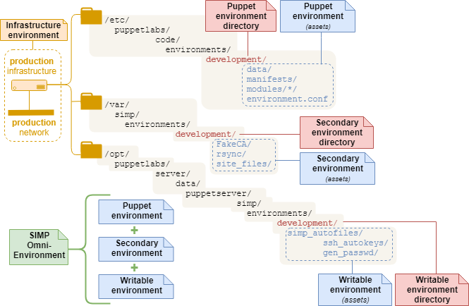

.. _faq-simp-omni-environment:

What is a SIMP Omni-Environment?
================================

This FAQ explains what the term "SIMP Omni-Environment" means.

A SIMP Omni-Environment is a set of three environments on the Puppet server
that is required for a SIMP Puppet environment to operate.  It is comprised of

* a Puppet environment
* a SIMP secondary environment
* a SIMP writable environment.

As shown in the diagram below, each environment is a directory on the Puppet
server with the same basename.

Puppet Environment Directory
----------------------------

* A single directory at ``$codedir/environments/<environment_name>``.
* The directory contains the assets for a specific Puppet environment, such as
  its own site manifest(s), modules, Hiera data (Hiera 4+), and Hiera hierarchy
  (Hiera 5+).
* ``r10k deploy`` creates one Puppet environment directory per control
  repository branch.
* ``r10k puppetfile install`` deploys modules from a local ``Puppetfile``
  into a module path for a Puppet environment.

SIMP Secondary Environment
--------------------------

* A single directory at ``/var/simp/environments/<environment_name>``
* The directory contains assets and information SIMP needs to support a specific
  Puppet environment, but which must be maintained independently from that
  environment's Puppet environment directory. These are files for which storage
  in a Puppet environment control repository is ill advised:

  * secrets (e.g., PKI certificates in ``site_files/pki_files/files/keydist/``)
  * large files SIMP distributes via ``rsync`` (e.g., ``tftpboot`` images in
    ``rsync/RedHat/Global/tftpboot``).

SIMP Writable Environment
-------------------------

* A single directory at 
  ``/opt/puppetlabs/server/data/puppetserver/simp/environments/<environment_name>``.
* The directory contains Puppet server-generated, environment-specific, SIMP data
  that is generated and/or read in by SIMP Puppet functions during catalog
  compilation.  This includes the passwords created by ``simplib::passgen()``.
