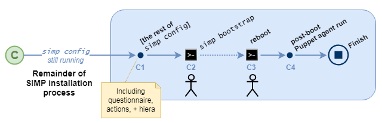
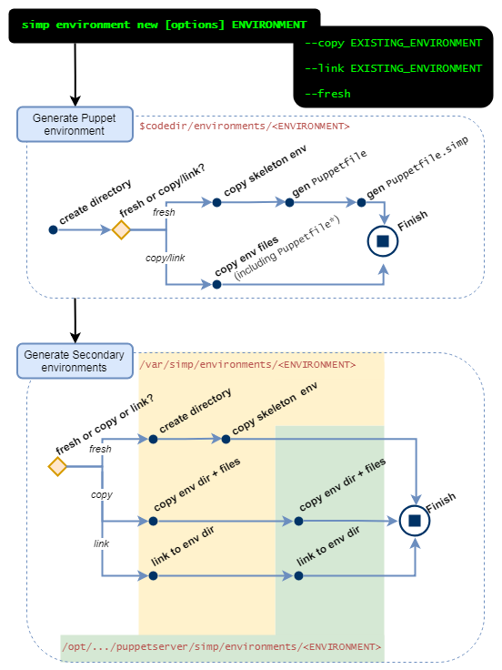
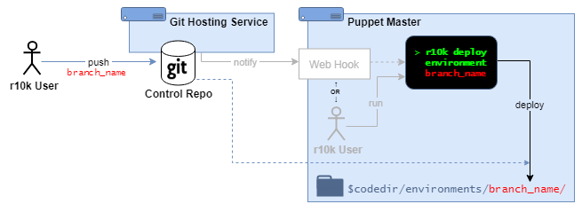
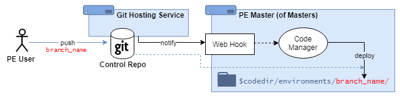

Introduction to SIMP 6.4.0
==========================

High-level workflow

**(Admin) installs SIMP from ISO**

.. image:: ./20190319_iso_critical_path-40000_ft_overview_A.png
   :alt: A diagram that describes an Admin installing SIMP from an ISO Info

(Admin) installs SIMP from ISO, using the SIMP docs procedure, `ISO Installation (preferred) <https://simp.readthedocs.io/en/6.3.3/getting_started_guide/Installation_Options/ISO/index.html>`_

* The OS and RPMs are installed according to the ISO's `auto.cfg. <https://github.com/simp/simp-core/blob/master/build/distributions/CentOS/7/x86_64/DVD/ks/dvd/auto.cfg>`_
* The post-installation of each Puppet module RPM will create an associated local bare git repository, with a tagged commit for the module's current version. 
* The rest of the SIMP ISO installation proceeds normally.

Key 6.4.0+ differences:

At the end of the ISO installation:

* All puppet modules have a local bare git repo, with a tagged commit
* There is no simp Puppet environment yet, ``/etc/puppetlabs/code/environments/simp``
* There is no  ``/var/simp/environments/simp`` yet

**Admin runs simp config**

.. image:: 20190319_iso_critical_path-40000_ft_overview_B.png

Admin logs into the newly-installed SIMP host and runs ``simp config``.

At an early stage (before applying with the standard action items from the questionnaire):

* Logic determines if it needs to create the first Puppet environment directory and auto-deploy the SIMP Puppet Modules
  (This will always be "yes" after a fresh ISO install)
* (If yes:) Auto-deploy the first Puppet environment + modules

**Key 6.4.0+ differences:**

All this logic is new to ``simp config``, and it replaces RPM logic in SIMP ≤ 6.3.  Specifically, it replaces the old logic between simp-environment and simp-adapter that effectively accomplished the "auto-deploy" in SIMP ≤ 6.3, but in an opinionated manner that can conflict with r10k administration. The old logic:

#. created the simp/ Puppet environment directory, and
#. auto-deployed each RPM-installed Puppet module's files into the simp Puppet environment using rsync.

By contrast, the new logic will:

#. ensure that a production environment exists under the Puppet (``/etc/puppetlabs``) and Secondary (``/var/simp/...``) environment directories, while running simp config. (Note that this is now the production/ environment - with r10k workflows, it doesn't make sense to create a simp/ symlinked to production/)
#. create an initial Puppetfile and Puppetfile.simp in the production Puppet environment directory
#. deploy the new Puppetfile using r10k puppetfile install 

A significant difference is that the simp config "auto-deploy" only runs once in the lifetime of the the SIMP server, whereas the SIMP ≤ 6.3 the auto-deploy executed during the %post or %posttrans of each Puppet Module and simp-environment RPM, including upgrades.

The initial Puppet environment in SIMP ≤ 6.3 was created upon the installation of the simp-environment RPM.
* There is only one circumstance when SIMP 6.4+ will auto-generate a Puppet environment, and that is when simp config is run on a Puppet server without any deployed Puppet environments.
* In practice, this means that  all later environments must be created by the administrator - never automatically.

The Puppet module auto-deploy logic in SIMP ≤ 6.3 executed immediately upon the installation of every RPM, which happened during and after the initial SIMP ISO installation.
* There is only one circumstance when SIMP 6.4+  will auto-deploy Puppet modules, and that is when ``simp config`` is run on a Puppet server without any deployed  Puppet modules.
* In practice, this means that all later deployments must be initiated by the administrator - never automatically.

**Remainder of SIMP installation process**

After deploying the initial Puppet environment, the rest of the SIMP installation continues without any specific alterations to support the Puppetfile-based workflow.  This includes the remainder of ``simp config``, (admin-initiated) ``simp bootstrap``, (admin-initiated) reboot, and the post-boot Puppet agent run.

Workflow details

**Puppet module RPMs + local bare git repositories**

.. image:: 20190319_iso_critical_path-A2_post-RPM_repos.png

* After a SIMP-packaged Puppet module RPM is installed, the system's ``simp_rpm_helper`` script ensures that a local bare git repository exists for the module, and it contains a commit of the modules files (tagged with the module's version).
* This is a prerequisite for ``simp puppetfile generate`` to work.
* A prototype for this workflow was already implemented during SIMP-6083. 

**simp config's initial "auto-deploy"**
The "auto-deploy" must perform at least three actions:

1. Create the production Puppet environment directory ``$codedir/environments/production`` and secondary environment directory at ``/var/simp/environments/production``.
     * There is currently no logic to do this.
     * A manual command has been proposed during architecture discussions, currently referred to as ``simp environment new ENVIRONMENT`` (see below).

2. Generate the Puppetfile and Puppetfile.simp in the Puppet environment directory. This can currently be accomplished manually by running:
     * ``simp puppetfile generate --skeleton > Puppetfile``
     * ``simp puppetfile generate > Puppetfile.simp``

3. Deploy the SIMP Puppet modules. This can be done by running ``r10k puppetfile install`` after the ``Puppetfile`` and ``Puppetfile.simp`` are in place.

**simp environment new ENVIRONMENT**
During the initial planning for the ISO installation, it was noted that the initial install (and subsequent admin work) would need to create environments.

Deployment scenarios 
This proposed ISO+Puppetfile workflow accommodates all common Puppetfile-based deployment methods as natively as possible.

**ISO-only: r10k + RPM-delivered module repositories**

.. image:: ./ISO-Only_R10kplusRPM-delivered.png

Local Puppet admin(s):

* deploy Puppet modules from an existing Puppet environment directory
* use the command ``r10k puppetfile install`` to deploy the modules defined in the local Puppetfile. 
* the module repos can be git repositories on the local filesystem, referenced via ``file://`` urls.

6.4.0+: The new ISO+Puppetfile workflow is most relevant to this scenario.  

* It automatically provides local git repositories for each module, and a tool to update the ``Puppetfile.simp``.
* It works immediately  after installing SIMP from an ISO in any environment (even offline).
* requires no extra infrastructure to get started
* requires no git expertise
* Users are only expected to maintain their (non-SIMP) Puppetfile (if necessary), and deploy RPM-delivered updates with ``r10k puppetfile install``.

6.4.0+:  Local Puppet admins may create new Puppet environments, however: *a Secondary environment is required to exist for each Puppet environment.*

* The secondary environment for production was generated automatically during ``simp config``'s initial auto-deploy
* New environments can be generated using the proposed command, ``simp environment new``.
* New environments can also be cloned or symlinked from an existing SIMP extra environment (associated secondary + writable environments).

**Professional: r10k + Control Repository**

.. HINT::
  Administrators of all control repository scenarios are assumed to have enough git and r10k (or Code Manager) expertise 
  to High-level workflow

Puppet admins:

* maintain a Puppet control repository from an external git service. 
* deploy entire Puppet environment directories (one environment for each repository branch) using ``r10k deploy environment [ENVIRONMENT]``
* This might be done manually from the command line, or triggered automatically (e.g., from a webhook).

6.4.0+:  The ISO+Puppetfile workflow will not interfere with this scenario, however *a Secondary environment is required to exist for each Puppet environment.*

* The secondary environment for production was generated automatically during simp config's initial auto-deploy 
* New environments can be generated using the proposed command, simp environment new.
* New environments can also be cloned or symlinked from an existing SIMP extra environment (associated secondary + writable environments).
* The simp environment new command can be configured to run after each deployment via the postrun setting in ``r10k.yaml``.

Enterprise: PE Code Manager + Control Repository

Puppet admins:

* maintain a Puppet control repository from an external git service. 
* deploy entire Puppet environment directories (one environment for each repository branch) using PE Code Manager.
  This is triggered automatically from a Code Manager webhook.

6.4.0+:  The ISO+Puppetfile workflow will not interfere with this scenario, however *a Secondary environment is required to exist for each Puppet environment.*

* The secondary environment for production was generated automatically during ``simp config``'s initial auto-deploy
* New environments can be generated or cloned using the proposed command, ``simp environment new``.
* can be configured to run after each environment deployment by setting postrun in Code Manager's ``r10k.yaml``.
* It may also be configured to run from a (not created) local webhook using Code Manager's ``post_environment_hooks`` setting.
* New environments can be generated using the proposed command, simp environment new.
* New environments can also be cloned or symlinked from an existing SIMP extra environment (associated secondary + writable environments).
* The simp environment new command can be configured to run after each environment deployment by setting postrun in Code Manager's ``r10k.yaml``.
* It may also be configured to run from a local webhook (not included) using Code Manager's ``post_environment_hooks`` setting. 

