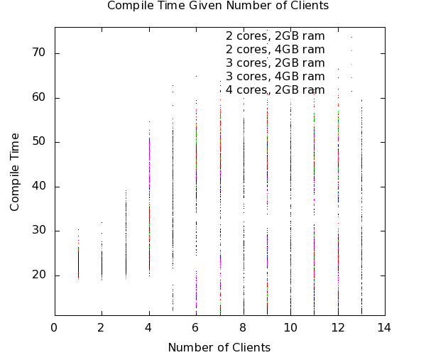

Maximum Number of Nodes
=======================

The maximum number of clients reasonable per each system is dependent on
many variables, including number of processors and size of memory.
Although it is impossible to predict exactly how many clients a specific
server may be able to handle, a simple algorithm can give the user an
estimate.

Servers with different hardware have been tested at worst case scenario.
This means that all of the server's clients will run Puppet at the exact
same time. The most important information collected during these runs
was the compile time, which shows the increase in seconds that it takes
for each node to compile when another node is added. After a certain
number of nodes, nodes begin to drop to compile times lower than 30
seconds. These nodes are not actually completing their Puppet runs. This
data can be seen in the following graph:

Number of Nodes vs. Compile Time
--------------------------------

The queue size can be found by looking at the maximum number of clients
running Puppet at once before any are dropped. According to the SIMP
team's data, a server with two cores has a queue size of four; a server
with three cores has a queue size of six; however, a server with four
cores has a queue size of six. Although it may appear that the queue
size is plateauing as cores are increased, the SIMP team predicts that
this is due to the limited memory. However, the team is confident that a
system with four cores and 4GB of ram will indeed have a queue size of
eight clients. From this, it can be concluded that, given enough memory,
**Queue\_Size = 2\*Cores**.

Also using this data, the compile times for other systems can be
predicted given the amount of processors, memory, and nodes. This is
done using ordinary least squares in Octave.

In addition, the maximum number of clients can also be predicted with
the use of the following equation:

*Max\_Num\_Of\_Total\_Clients = (Run\_Time\_In\_Sec / Comp\_Time) \*
Queue\_Size*

Where *Run\_Time\_In\_Sec* is the number of seconds per half an hour
(1800), *Queue\_Size* is the maximum number of clients in the worst case
scenario (queue size), and *Comp\_Time* is the average compile time of
the clients when there are *Max\_Num\_Worstcase* clients.

